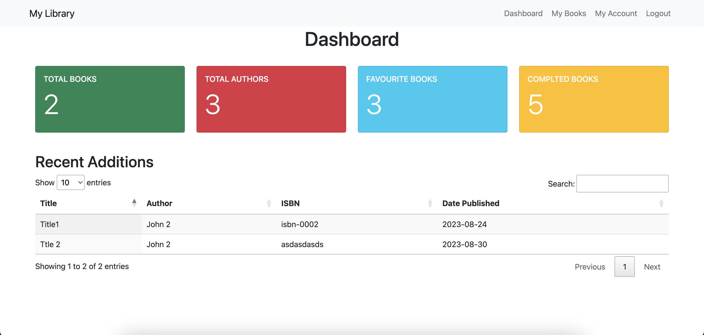
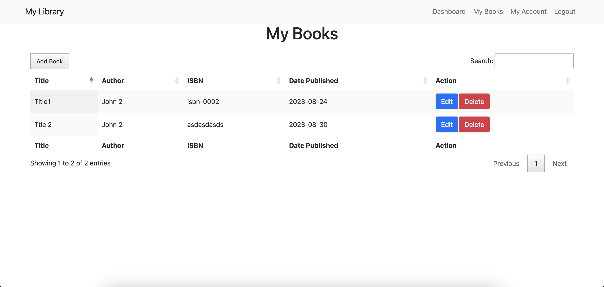
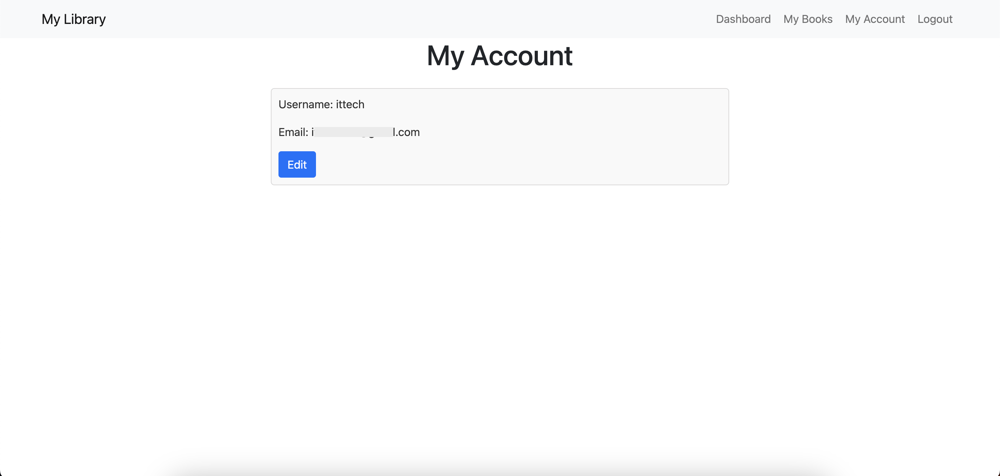

# FastAPI Book management system

This is a simple book management system developed using FASTAPI + Jquery + Jinj2

## Table of Content

- [Demo](#Demo)
- [Requirements](#Requirements)
- [How to install and use application](#How-to-install-and-use-application)
  - [Run locally](#Run-locally)
    - [Bring up the FastAPI server](#Bring-up-the-FastAPI-server)
  - [Run on Docker](#Run-on-Docker)
    - [Build docker images](#Build-docker-images)
    - [Run as docker containers](#Run-as-docker-containers)
- [Testing](#Testing)
- [Technologies and architecture](#Technologies-and-architecture)

## Demo






## Requirements

### Application has been successfully run on following versions

- python 3.10
- pip 23.1.2

## How to install and use application

### Run locally

Navigate to project root directory

```bash
cd fastapi_library_system
```

Run following commands to create a python virtual env and install required packages

If any failure, check [troubleshoot](#Troubleshooting) section

```bash
python3 -m venv .venv
source .venv/bin/activate
pip3 install -r requirements.txt
```

#### Bring up the FastAPI server

Export following environment variable in current terminal with correct values.

```bash
APP_SECRET=my_secret
LOG_LEVEL=DEBUG
APP_CONFIG=development
```

By default, application will run on development mode with DEBUG level. Override default behavior exporting following variables in terminal.

Supported values:

- APP_CONFIG - development, production, testing
- LOG_LEVEL - INFO, DEBUG etc..

```bash
export APP_CONFIG=development
export LOG_LEVEL=DEBUG
```

To run FastAPI server execute the following command. If any failure, check [troubleshoot](#Troubleshooting) section

```bash
uvicorn main:app --reload --reload-dir .  --host 0.0.0.0 --port 8000
```

### Run on Docker

#### Build docker images

To build Docker image, execute the following from the root directory. This command will create following image

- app_server:0.0.1


```bash
docker-compose build
```

#### Run as docker containers

This step is optional. You may proceed to [Run on Kind cluster](#Run-on-Kind-cluster)

Set required values in .env file(docker-compose uses .env by default if --env-file=FILE_PATH is not specified)

Bring up Docker containers running the following command

```bash
docker-compose up
```

- Open your browser at `http://localhost:8000/` to see the app.
- Open your browser at `http://localhost:8000/docs` to see REST endpoint.

## Testing

To run tests execute the following commands in a new terminal:

If any failure, check [troubleshoot](#Troubleshooting) section

```bash
cd fastapi_library_system
source .venv/bin/activate
pip3 install -r requirements-test.txt
pytest
```

### Technologies

- Jqeury
- Jquery Ajax
- Boostrap
- Jinja2
- JWT
- FastAPI
- Pydanthic
- SQLITE

## TODO

- Add Book cover photo upload functionality
- Add more test cases

## Tools used

- black 
- flake8